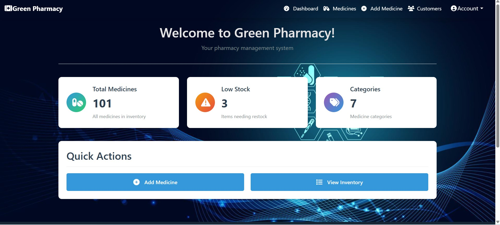
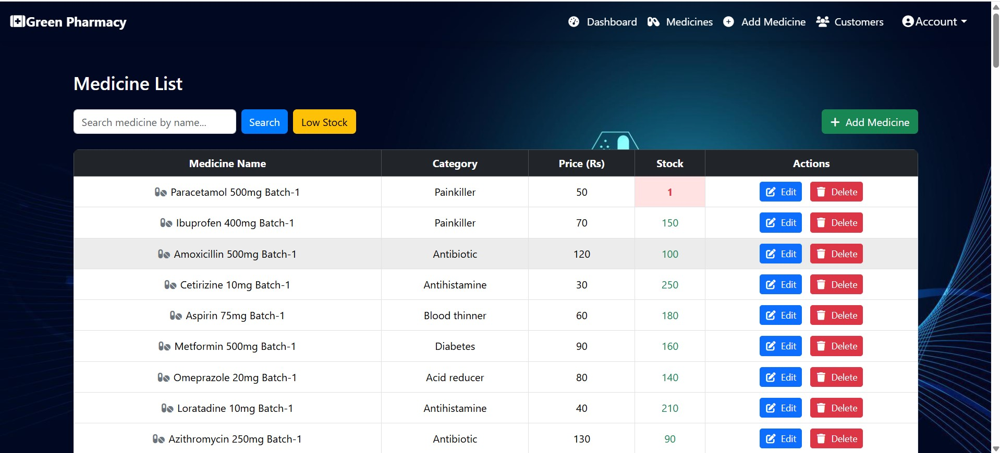
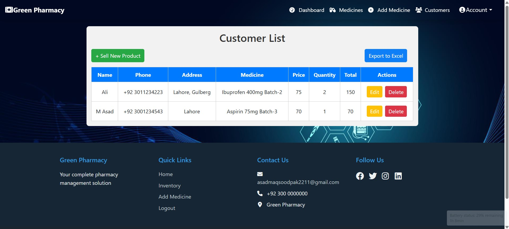

# 💊 MediStore Manager

**MediStore Manager** is a full-stack medicine store management system developed for efficiently handling inventory, employee tasks, and customer transactions. This system is designed for shop owners to securely manage all operations through a user-friendly web interface.

---

## 🔧 Tech Stack

- **Frontend:** HTML, CSS, Bootstrap, JavaScript
- **Backend:** Node.js, Express.js
- **Database:** MongoDB

---

## 🚀 Key Features

- 🔐 **Secure Login & Signup:**  
  Authentication system for shop owners only — unauthorized users cannot access the system.

- 💊 **Medicine Management (CRUD):**  
  Add, update, delete, and view medicine records. Low-stock medicines are automatically highlighted for easy tracking.

- 🧾 **Sell Product (Customer Module):**  
  Record customer details like name, phone, address, selected medicine, and total bill. All customer transactions are saved in the database.

- 🧑‍💼 **Owner Profile Management:**  
  Shop owner can update profile information including name, email, password, shop name, and address.

---

## 📸 Screenshots

### 🏠 Home Page

### 💊 Medicine Management

### 🧾 Sell Product / Customer Info

